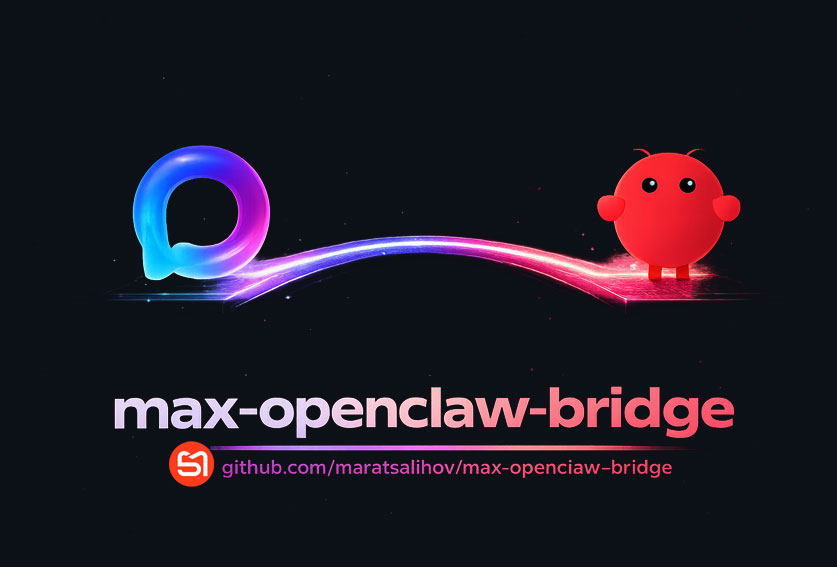

# MAX.ru ↔ OpenClaw Bridge



Bridge between [MAX.ru](https://max.ru) messenger and [OpenClaw](https://openclaw.ai) AI assistant. Chat with your AI assistant directly from MAX on any device.

**English**

---

## Features

- **Persistent sessions** — each user gets a stable `agent:main:openai:max:<userId>` session via the `user` field (OpenAI-compatible)
- **Streaming responses** — receives OpenClaw responses as a stream, forwarded to MAX
- **Typing indicator** — shows "typing..." in MAX while AI is thinking
- **Tool status logging** — logs active tools (search, browser, file ops) to console
- **Multi-user** — supports multiple MAX users with separate persistent sessions
- **Webhook endpoint** — POST `/webhook` for external cron/notification delivery to MAX
- **Health check** — GET `/health` endpoint
- **Built-in scheduler** — cron-based reminders delivered directly to MAX
- **Long polling** — polls MAX API for incoming messages

## Prerequisites

- [Node.js](https://nodejs.org/) 18+
- OpenClaw gateway running (`openclaw gateway run`)
- MAX developer account with API token

## Setup

### 1. Get MAX API token

Register at [dev.max.ru](https://dev.max.ru) and create a bot/app to get your API token.

### 2. Get your MAX user ID

The bridge uses `user_id` from MAX API. You can find it:
- In the MAX app developer tools
- From the first update response when you message your bot

### 3. Install and configure

```bash
git clone https://github.com/maratsalihov/max-openclaw-bridge.git
cd max-openclaw-bridge
npm install
cp .env.example .env
```

Edit `.env`:

```env
# Required
MAX_TOKEN=your_max_api_token_here
ALLOWED_USER_IDS=12345678,87654321

# Optional - defaults below
OC_GATEWAY_HOST=127.0.0.1
OC_GATEWAY_PORT=18789
BRIDGE_PORT=8789
# OC_TOKEN=your_openclaw_gateway_token_here
```

The bridge auto-detects the OpenClaw gateway token from `~/.openclaw/openclaw.json`. Set `OC_TOKEN` in `.env` to override.

### 4. Run

```bash
node max-bridge.js
```

### 5. Message your MAX bot

Open MAX, send a message to your bot — it will be forwarded to OpenClaw and the reply will come back.

## Webhook (cron notifications)

OpenClaw cron jobs can deliver announcements to MAX via the bridge webhook:

```bash
openclaw cron edit <id> --announce --webhook http://127.0.0.1:8789/webhook
```

The webhook accepts POST with JSON body:
```json
{ "text": "Your notification message", "userId": 12345678 }
```

`userId` is optional — defaults to the first allowed user.

## Built-in Scheduler

Add recurring reminders by editing `SCHEDULES` in `max-bridge.js`:

```js
const SCHEDULES = [
  {
    id: 'my-reminder',
    cron: '0 14 * * *',   // UTC
    message: 'Your reminder text',
    userId: 12345678
  }
];
```

The scheduler checks every 30 seconds and prevents duplicate sends within the same day.

## Configuration Reference

| Variable | Required | Default | Description |
|----------|----------|---------|-------------|
| `MAX_TOKEN` | ✅ | — | MAX API token from dev.max.ru |
| `ALLOWED_USER_IDS` | ✅ | — | Comma-separated MAX user IDs allowed to use the bridge |
| `OC_GATEWAY_HOST` | | `127.0.0.1` | OpenClaw gateway host |
| `OC_GATEWAY_PORT` | | `18789` | OpenClaw gateway port |
| `BRIDGE_PORT` | | `8789` | Bridge webhook server port |
| `OC_TOKEN` | | auto-detect | OpenClaw gateway auth token |

## MAX API Reference

The bridge uses the MAX Platform API:

- **Base URL:** `https://platform-api.max.ru`
- **Auth:** `Authorization: <MAX_TOKEN>` header
- **Long Polling:** `GET /updates?timeout=20&limit=10&marker=<marker>`
- **Send message:** `POST /messages?user_id=<id>` with body `{ "text": "..." }`
- **Typing indicator:** `POST /chats/{user_id}/actions` with `{ "action": "typing_on" }`

## PM2 (production)

```bash
npm install -g pm2
pm2 start max-bridge.js --name max-bridge
pm2 save
pm2 startup
```

## License

MIT
